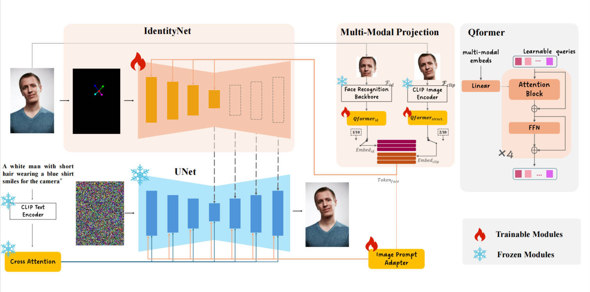
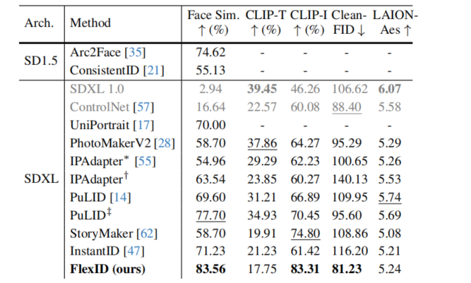

# FlexID
FlexID: Decoupling Identity and Extrinsic Facial Attributes in Zero-Shot Identity-Preserving Generation

## Introduction
In the task of image personalization, faces are the most representative visual features in social interactions, which makes humans highly sensitive to facial characteristics. This creates a significant challenge: how to maintain high consistency in face generation while preserving the editability of the umage. Previous researches have predominantly focused on reconstructing identity (ID) attributes, paying little attention to structural attributes such as glasses, hairstyles, tattoos, and facial shapes, etc. However, in many scenarios, structural attributes greatly influence recognizability, leading to a lack of resemblance in faces generated by current methods. To address these challenges, we propose IDOL, a powerful solution based on diffusion models. We introduce a novel multi-attribute facial representation method that incorporates different modalities to learn features at different granularities. By employing multi-stage learning, these features are mapped to distinct facial attribute spaces, enabling the generation process to preserve facial details. Our approach also successfully disentangles ID and structural attributes, allowing independent control over facial pose, identity, and facial decorations through image prompts, thus facilitating multi-modal image generation. Using FFHQ and IMDB-WIKI datasets as benchmarks, our experimental results demonstrate that our method achieves superior performance in generating consistent faces, with a 17.31\% improvement in facial similarity compared to the current state-of-the-art. Moreover, we effectively disentangle ID and structural attributes, enabling independent input control and compatibility with other advanced community components, unlocking significant potential for this technology.

## Application Summary

## Qualitative Analysis

## Quantitative Analysis
Quantitative comparison with different methods.The best result is shown in bold, and the second best is underlined. 'IPAdapter∗' refers to IPAdapter-faceID-plus-v2, while 'IPAdapter†'
denotes IPAdapter-faceID-Portrait-Unnormal. 'PuLID' represents the result of inference by PuLID v1 model on SDXL Lighting, while 'PuLID‡' represents the result of inference by PuLIDv1.1 on SDXL. Additionally, since UniPortrait does not have an open-source model, we tested 50 images using recommended parameters from the official demo to calculate similarity scores as a reference, yielding an FlexID similarity score of 0.85 for these images. Furthermore, we selected two works based on SD1.5 with high similarity scores as additional references; however, due to differences in the underlying models, we only calculated face similarity for comparison.

## Flexible Control
